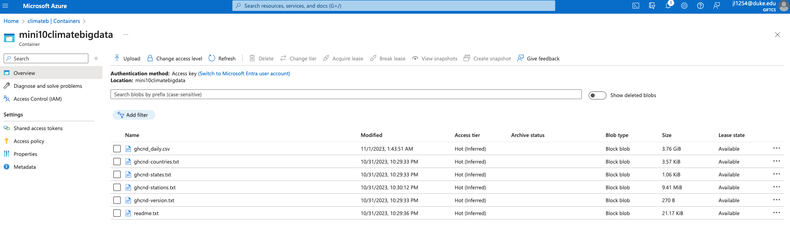
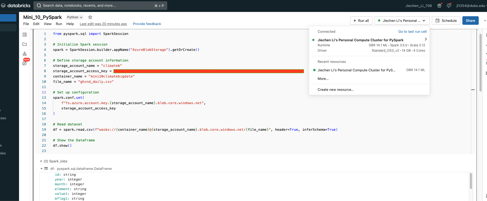
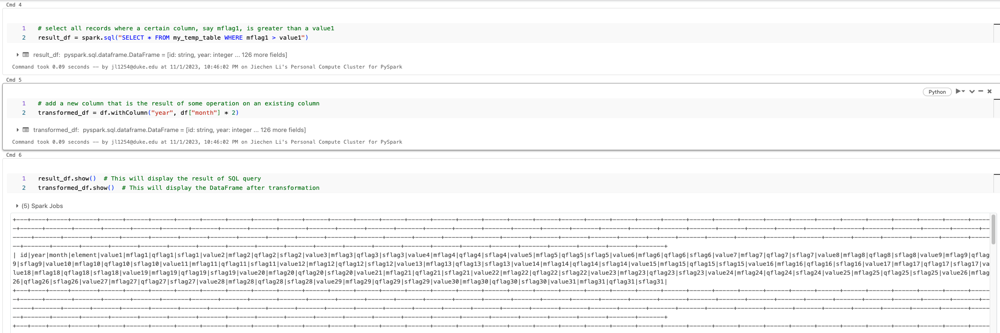

# Jiechen_Li_Mini_10_PySpark

## Purpose

* Use PySpark to perform data processing on a large dataset
* Include at least one Spark SQL query and one data transformation
* Provide an user guide for both PySpark setup and the query

## Dataset

This data comes from the [Global Historical Climatology Network](https://www.drought.gov/data-maps-tools/global-historical-climatology-network-ghcn), and is the actual raw data provided by [NOAA](https://www.noaa.gov/). Begin by unzipping the file and checking it's size -- it should come out to be about **4GB**, but will expand to about 12 GB in RAM, which means there's just no way most most of us can import this dataset into pandas and manipulate it directly and analysis in local IDE.

## Connect to Azure

### Step 1: Create an Azure Storage Account

1. **Sign in** to the Azure Portal.
2. In the Azure portal, select **Create a resource**.
3. Search for and select **Storage account**.
4. On the **Create storage account** page, select our subscription and either create a new resource group or use an existing one.
5. Enter a unique name for the storage account.
6. Choose the location closest to me.
7. Leave the other options to their default values (unless we have specific requirements).
8. Click **Review + Create** and then **Create** once validation passes.

### Step 2: Create a Blob Container

1. Once the storage account is created, go to it in the Azure portal.
2. In the overview page of the storage account, scroll to the **Blob service** section, then select **Containers**.
3. Select the **+ Container** button to add a new container.
4. Name the container and set the public access level according to our needs.
5. Click **Create**.

### Step 3: Upload Dataset

1. Go to the newly created container.
2. Select the **Upload** button.
3. Click the folder icon next to the **"files"** box or drag and drop your dataset files into the box.
4. Click the **Advanced** tab if you want to upload to a subfolder within the container.
5. Click **Upload**.

### Step 4: Create Azure Databricks

1. In the Azure portal, click on "Azure Databricks" and create a new Databricks workspace.
2. Click on the "Notebook" button, and create a new compute cluster. Notebook is where we can write and execute our PySpark code. We can perform data transformations, write Spark SQL queries, visualize data, and document the process.

### Step 5: Use PySpark with Azure Blob Storage

1. **Connect** Blob Storage to read the big csv file.
2. Launch the **Databricks workspace**, and loaded the CSV big data into a PySpark DataFrame.

## PySpark Deliverable

1. [Mini_10_PySpark in Databricks Workplace](https://adb-8105252383820269.9.azuredatabricks.net/?o=8105252383820269#notebook/3928159747808780)

2. Please check ``Mini_10_PySpark_Databricks.pdf`` for detailed output.

## Results

1. **Upoad the Big Data**
   

2. **Read with PySpark on big dataset stored in Azure Blob Storage**
 

3. **Spark SQL query and Data Transformation**
 

## Reference

Please click <a href="https://github.com/nogibjj/Jiechen_Li_Mini_6_MySQL.git" target="_blank">here</a> to see the template of this repo.
